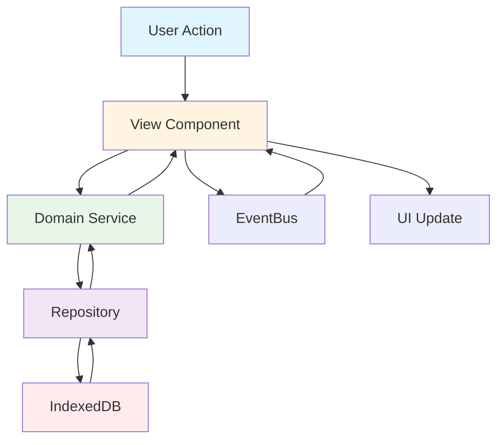

# سیستم سوال و جواب داخلی شرکت

یک وب‌اپلیکیشن سبک و کامل برای سیستم Q&A داخلی شرکت، مشابه StackOverflow اما ساده‌تر.

## ویژگی‌ها

- ✅ احراز هویت ساده (بدون پسورد برای MVP)
- ✅ مدیریت سوال‌ها (ایجاد، ویرایش، حذف، جستجو، فیلتر)
- ✅ سیستم پاسخ‌دهی و رای‌دهی
- ✅ پذیرفتن پاسخ (Accept Answer)
- ✅ مدیریت کاربران (برای Admin)
- ✅ Export/Import داده‌ها به صورت JSON
- ✅ طراحی Responsive و قابل دسترس
- ✅ ذخیره‌سازی محلی با IndexedDB

## تکنولوژی‌ها

- **HTML5** - ساختار صفحه
- **CSS3** - استایل‌دهی (Grid, Flexbox)
- **Vanilla JavaScript (ES6+)** - منطق برنامه
- **IndexedDB** - ذخیره‌سازی داده‌ها
- **ES Modules** - ماژولار بودن کد

**بدون استفاده از:**
- ❌ هیچ فریمورک (React, Vue, Angular)
- ❌ Build Tools (Webpack, Vite, etc.)
- ❌ کتابخانه‌های خارجی (CDN)
- ❌ Backend Server

## ساختار پروژه

```
question-answer/
├── index.html              # صفحه اصلی
├── assets/
│   └── styles.css          # استایل‌های اصلی
├── src/
│   ├── main.js             # نقطه ورود برنامه
│   ├── core/               # ماژول‌های پایه
│   │   ├── router.js       # Router ساده (Hash-based)
│   │   ├── eventBus.js     # Event Bus (Pub/Sub)
│   │   ├── dom.js          # توابع کمکی DOM
│   │   ├── validation.js   # اعتبارسنجی داده‌ها
│   │   ├── error.js        # مدیریت خطا
│   │   ├── logger.js        # سیستم لاگ
│   │   ├── toast.js        # اعلان‌های Toast
│   │   └── utils.js        # توابع کمکی
│   ├── data/               # لایه داده
│   │   ├── indexeddb.js    # کلاینت IndexedDB
│   │   ├── exportImport.js # Export/Import
│   │   └── repositories/   # Repository Pattern
│   │       ├── userRepository.js
│   │       ├── questionRepository.js
│   │       ├── answerRepository.js
│   │       └── voteRepository.js
│   ├── domain/             # لایه دامنه
│   │   ├── models/         # مدل‌های دامنه
│   │   │   ├── user.js
│   │   │   ├── question.js
│   │   │   ├── answer.js
│   │   │   └── vote.js
│   │   └── services/       # سرویس‌های دامنه
│   │       ├── userService.js
│   │       ├── questionService.js
│   │       └── answerService.js
│   ├── ui/                 # لایه رابط کاربری
│   │   ├── components/     # کامپوننت‌های قابل استفاده مجدد
│   │   │   ├── questionCard.js
│   │   │   └── voteButtons.js
│   │   └── views/          # View های صفحه
│   │       ├── loginView.js
│   │       ├── questionsListView.js
│   │       ├── newQuestionView.js
│   │       ├── questionDetailView.js
│   │       └── adminView.js
│   └── seed/               # داده‌های اولیه
│       ├── seedData.js
│       └── seed.js
└── README.md
```

## معماری

سیستم از معماری لایه‌ای (Layered Architecture) استفاده می‌کند:

```
┌─────────────────────────────────────────┐
│           UI Layer (Views)              │
│  (Login, Questions, Admin, etc.)       │
└──────────────┬──────────────────────────┘
               │
┌──────────────▼──────────────────────────┐
│        Domain Services                  │
│  (UserService, QuestionService, etc.)  │
└──────────────┬──────────────────────────┘
               │
┌──────────────▼──────────────────────────┐
│        Repositories                     │
│  (UserRepo, QuestionRepo, etc.)         │
└──────────────┬──────────────────────────┘
               │
┌──────────────▼──────────────────────────┐
│        IndexedDB Client                 │
│  (Database Operations)                  │
└─────────────────────────────────────────┘
```

### دیاگرام جریان داده



## نحوه اجرا

### روش 1: باز کردن مستقیم فایل

1. فایل `index.html` را در مرورگر باز کنید
2. سیستم به صورت خودکار IndexedDB را راه‌اندازی می‌کند

### روش 2: استفاده از Static Server (توصیه می‌شود)

```bash
# با Python
python -m http.server 8000

# با Node.js (http-server)
npx http-server -p 8000

# با PHP
php -S localhost:8000
```

سپس به آدرس `http://localhost:8000` بروید.

### برای GitHub Pages

1. پروژه را در GitHub push کنید
2. در Settings > Pages، branch اصلی را انتخاب کنید
3. آدرس `https://username.github.io/repo-name` در دسترس خواهد بود

## کاربران پیش‌فرض (Seed Data)

سیستم به صورت خودکار با داده‌های اولیه پر می‌شود:

| نام کاربری | نقش | دپارتمان |
|-----------|-----|----------|
| `admin` | Admin | IT |
| `moderator1` | Moderator | HR |
| `employee1` | Employee | Development |

**نکته:** برای ورود، فقط نام کاربری را وارد کنید (بدون پسورد).

## صفحات و Route ها

- `#/login` - صفحه ورود
- `#/questions` - لیست سوال‌ها
- `#/questions/new` - ایجاد سوال جدید
- `#/questions/:id` - جزئیات سوال
- `#/admin` - پنل مدیریت (فقط Admin)

## قابلیت‌ها

### مدیریت سوال‌ها

- ایجاد سوال با عنوان، متن، تگ‌ها، دپارتمان و سطح اهمیت
- جستجو در عنوان سوال‌ها
- فیلتر بر اساس تگ و دپارتمان
- مرتب‌سازی (جدیدترین، قدیمی‌ترین، بیشترین/کمترین رای)
- صفحه‌بندی (Pagination)
- ویرایش و حذف (فقط نویسنده یا Moderator/Admin)

### سیستم پاسخ‌دهی

- افزودن پاسخ به سوال
- رای مثبت/منفی روی پاسخ
- پذیرفتن پاسخ (Accept Answer) - فقط نویسنده سوال یا Moderator/Admin
- نمایش پاسخ پذیرفته شده در بالا

### رای‌دهی

- هر کاربر فقط یک‌بار می‌تواند به هر سوال/پاسخ رای دهد
- امکان تغییر رای (Toggle)
- نمایش امتیاز در UI

### Export/Import

- **Export:** خروجی تمام داده‌ها به فایل JSON
- **Import:** وارد کردن داده‌ها از JSON با اعتبارسنجی schema
- **حالت Import:** Replace All (جایگزینی کامل)

## محدودیت‌ها و فرض‌ها

### محدودیت‌های MVP

1. **چندکاربره واقعی:** چون بک‌اند نداریم، سیستم چندکاربره واقعی/اشتراک‌گذاری بین کاربران مختلف به صورت کامل ممکن نیست. داده‌ها در مرورگر هر کاربر ذخیره می‌شود.

2. **ذخیره‌سازی محلی:** تمام داده‌ها در IndexedDB مرورگر ذخیره می‌شوند و با پاک کردن cache مرورگر از بین می‌روند.

3. **احراز هویت ساده:** برای MVP، فقط نام کاربری لازم است (بدون پسورد).

4. **Export/Import:** برای انتقال داده بین سیستم‌ها، از قابلیت Export/Import استفاده کنید.

### تصمیمات معماری

1. **Hash-based Routing:** برای سازگاری با GitHub Pages و عدم نیاز به تنظیمات server-side

2. **Repository Pattern:** جداسازی منطق دسترسی به داده از منطق دامنه

3. **Service Layer:** قرار دادن قوانین کسب‌وکار در لایه Service

4. **Event Bus:** ارتباط loose coupling بین کامپوننت‌ها

5. **Result Pattern:** مدیریت خطا به صورت ساختاریافته

## امنیت (Frontend)

- استفاده از `textContent` به جای `innerHTML` برای جلوگیری از XSS
- اعتبارسنجی ورودی کاربر در لایه Validation
- Sanitization تگ‌ها و ورودی‌ها

## دسترسی‌پذیری (Accessibility)

- استفاده از `aria-label` برای کنترل‌های مهم
- ناوبری با کیبورد
- Focus state واضح
- Semantic HTML

## Performance

- صفحه‌بندی برای لیست سوال‌ها
- Lazy loading برای داده‌ها
- بهینه‌سازی رندر DOM

## توسعه و Debug

برای فعال کردن لاگ‌های توسعه:

```javascript
import { logger } from './core/logger.js';

logger.setLevel('DEBUG'); // یا 'INFO', 'WARN', 'ERROR'
logger.enable();
```

## تست

برای تست دستی:

1. ورود با کاربران مختلف
2. ایجاد سوال و پاسخ
3. رای‌دهی
4. ویرایش و حذف
5. Export/Import داده‌ها
6. تست در مرورگرهای مختلف

## مرورگرهای پشتیبانی شده

- Chrome/Edge (جدید)
- Firefox (جدید)
- Safari (جدید)

نیاز به پشتیبانی از:
- ES6 Modules
- IndexedDB
- Async/Await

## مجوز

این پروژه برای استفاده داخلی شرکت ساخته شده است.

## نکات مهم

- تمام کدها با Vanilla JavaScript نوشته شده‌اند
- هیچ وابستگی خارجی وجود ندارد
- پروژه آماده برای استقرار در GitHub Pages است
- کدها ماژولار و قابل نگهداری هستند

---

**ساخته شده با ❤️ برای استفاده داخلی شرکت**
